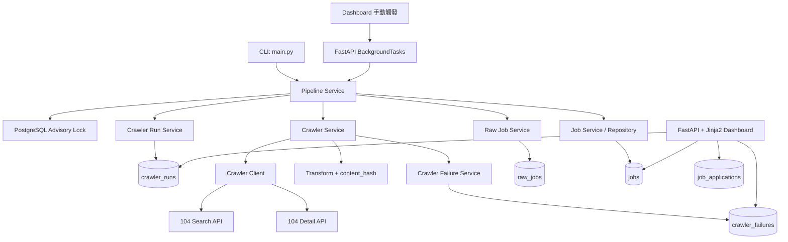
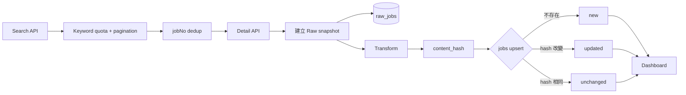

# Job Radar

Job Radar 是一套自動蒐集、清洗、追蹤工程師職缺的資料 Pipeline 與求職管理 Dashboard。

目前 V1 聚焦於 Data Pipeline 與 Backend：從 104 公開的 Search / Detail API 蒐集職缺，保存 Raw snapshot、維護可查詢的 Clean data，並透過 FastAPI Dashboard 追蹤職缺內容與個人求職狀態。

## 1. 專案動機

求職過程常需要反覆搜尋不同工程師關鍵字，職缺分散且 JD 可能在刊登期間更新，也不容易記住哪些職缺已看過、收藏或投遞。

Job Radar 將這段流程整理為：

```text
104 → 自動蒐集 → Raw 保存 → Transform → Clean DB → Dashboard → 求職狀態管理
```

這不是 AI 專案；V1 的核心是可追蹤、可重跑的資料 Pipeline，以及 server-rendered Backend Dashboard。

## 2. Architecture



`run_pipeline()` 是 CLI 與 Dashboard 共用的唯一 orchestration 入口，負責 lock、run audit、crawler、Raw/Clean 寫入與最終狀態。

## 3. Data Flow



- `new`：`source_job_id` 不存在，建立新職缺。
- `updated`：職缺存在但 `content_hash` 改變，更新 Clean fields 與 `content_updated_at`。
- `unchanged`：`content_hash` 相同，不改 JD，只更新 `last_seen_at`。

每次成功取得 Detail data 都會建立新的 Raw snapshot；`raw_jobs` 不以 jobNo 去重。

## 4. Tech Stack

### Backend

- Python 3.13+
- FastAPI
- Jinja2
- Uvicorn
- Server-rendered HTML forms

### Crawler

- requests
- 104 Search / Detail API

### Database

- PostgreSQL 16
- SQLAlchemy 2
- psycopg 3
- Alembic

### Testing / Development

- pytest
- uv
- Docker Compose

## 5. Project Structure

```text
app/
├── api/              # FastAPI routes 與 Dashboard 查詢
├── crawler/          # HTTP client 與純資料 transform
├── db/               # SQLAlchemy engine、session、Base
├── models/           # ORM models
├── repositories/     # Database CRUD / query
├── services/         # Pipeline 與 application orchestration
├── templates/        # Jinja2 templates
└── static/           # Dashboard CSS
alembic/
└── versions/         # Database migrations
tests/                # pytest 測試
docker-compose.yml    # Local PostgreSQL
main.py               # CLI pipeline entry point
```

## 6. Database Design

- `jobs`：每個 104 jobNo 的最新 Clean state，供搜尋與 Dashboard 顯示。
- `raw_jobs`：每次成功取得的原始 Search + Detail JSON snapshot，維持 append-only。
- `crawler_runs`：每次 pipeline 的 trigger、狀態、時間、統計與整體錯誤。
- `crawler_failures`：單筆 crawler failure，包含 stage、jobNo、嘗試次數與錯誤內容。
- `job_applications`：每個 job 最多一筆個人求職狀態、備註與投遞／面試時間。

Database schema 由 Alembic migrations 管理。

## 7. Reliability Design

- HTTP requests 設有 timeout。
- Detail API 對 `429` 與 `5xx` 使用有限次 retry 與 exponential backoff。
- `403` 不持續重試。
- 單筆 Detail failure 會寫入 `crawler_failures`，不會中止其餘職缺。
- PostgreSQL Advisory Lock 防止 CLI 或 Dashboard 同時啟動多個 pipeline。
- `crawler_runs` 記錄 `RUNNING`、`SUCCESS`、`PARTIAL_SUCCESS` 或 `FAILED`。
- Pipeline exception 會嘗試寫入 `FAILED`，並在 `finally` 釋放 advisory lock。
- Dashboard 手動更新使用 FastAPI `BackgroundTasks`，POST 後立即 redirect。

## 8. Job Change Detection

`content_hash` 由職稱、公司、地區、完整 JD、經驗與學歷等重要 Clean fields 計算。相同 jobNo 再次出現時，repository 以 hash 判斷內容是否真正改變。

- `first_seen_at`：第一次發現職缺的時間，之後不變。
- `last_seen_at`：crawler 最近一次再次看見該職缺的時間。
- `content_updated_at`：重要內容最近一次改變的時間；新職缺及從未改變者為 `NULL`。

Dashboard 的「今日新增」使用 `first_seen_at`，「JD 更新」使用 `content_updated_at`，日期邊界以 `Asia/Taipei` 計算。

## 9. Local Setup

### Prerequisites

- Python 3.13+
- [uv](https://docs.astral.sh/uv/)
- Docker 與 Docker Compose

### 1. Clone repository

```bash
git clone <repository-url>
cd job-radar
```

### 2. 建立環境設定

```bash
cp .env.example .env
```

PowerShell 可使用：

```powershell
Copy-Item .env.example .env
```

### 3. 啟動 PostgreSQL

```bash
docker compose up -d postgres
```

預設 local port 為 `5434`，資料保存在 named volume；停止 container 不會自動刪除資料。

### 4. 安裝 dependencies

```bash
uv sync
```

### 5. 執行 migrations

```bash
uv run alembic upgrade head
```

### 6. 執行 crawler

```bash
uv run python main.py
```

搜尋關鍵字、quota、最大筆數與頁數目前由 `app/config.py` 設定。請遵守資料來源的使用條款、保持合理請求量；本專案不繞過 CAPTCHA 或登入限制。

### 7. 啟動 Dashboard

```bash
uv run uvicorn app.api.web:app --reload
```

開啟 <http://127.0.0.1:8000>。

### 8. 執行測試

```bash
uv run pytest
```

測試會使用 `DATABASE_URL` 指向的 PostgreSQL。請使用 local development/test database，不要指向 production database。

## 10. Environment Variables

目前只有一個必要環境變數：

| Variable | Description |
| --- | --- |
| `DATABASE_URL` | SQLAlchemy / psycopg 使用的 PostgreSQL connection URL |

安全的 local 範例請參考 `.env.example`。不要 commit 真實 `.env` 或 production credentials。

## 11. Dashboard Features

- 瀏覽全部職缺，固定以最新 `first_seen_at` 優先。
- 以 `Asia/Taipei` 顯示今日新增與今日 JD 更新。
- 關鍵字搜尋、地區篩選與 pagination。
- 求職狀態：未處理、收藏、已投遞、面試、不考慮、已結束。
- 每筆職缺可保存個人備註；投遞與面試狀態會記錄首次時間。
- Crawler Runs 與 Failure Monitoring 頁面。
- 從 Dashboard 立即觸發背景 crawler，並避免 concurrent run。

## 12. Testing

```bash
uv run pytest
```

目前測試涵蓋：

- Transform 與 `content_hash`。
- Detail API retry、backoff 與 `403` 行為（HTTP 皆使用 mock）。
- 單筆 Detail failure 不影響其餘職缺。
- PostgreSQL Advisory Lock 與共用 pipeline。
- Job upsert、內容更新時間與求職狀態 repository/service。
- Jobs Dashboard、filter、pagination、monitoring pages 與手動 background trigger。

測試不會呼叫真正的 104 API；需要可連線且已 migration 的 PostgreSQL。

## 13. Current Scope / Future Work

### V1 已完成

- 104 職缺 Data Pipeline
- Raw / Clean / Audit / Failure data model
- Job change detection
- FastAPI Dashboard 與個人求職狀態管理
- CLI / Dashboard 共用 pipeline 與手動背景更新
- Alembic migrations 與 pytest coverage

### Future（尚未實作）

- Cloud Run Job
- Cloud SQL
- Cloud Scheduler
- Cloud Run Service
- Secret Manager
- AI Job Matching

以上 Future 項目僅是可能的部署與產品方向，目前 repository 尚未包含相關實作。
